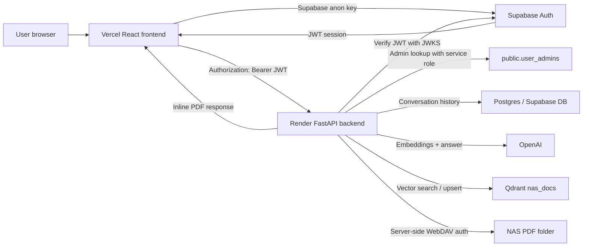

# ChatMyDocs.ai

ChatMyDocs.ai is an authenticated document assistant for asking questions over indexed PDF documents. The frontend is a React/Vite app. The backend is a FastAPI service in the separate `kb-agent` repository. Supabase handles authentication and admin lookup, Qdrant stores vector embeddings, OpenAI generates embeddings and answers, and the NAS stores the original PDF files.

This README documents the app end to end: architecture, frontend components, backend services, authentication, document upload, document opening, deployment, and the work completed during setup.

## Repositories

| Area | Local path | GitHub |
| --- | --- | --- |
| Frontend | `/Users/zelalemsirag/Downloads/ChatMyDocFE` | `https://github.com/zenchgithub/ChatMyDocFE` |
| Backend | `/Users/zelalemsirag/kb-agent` | `https://github.com/zenchgithub/kb-agent` |

## Production Services

| Service | Purpose |
| --- | --- |
| Vercel | Hosts the React frontend at `https://chatmydocs.ai`. |
| Render | Hosts the FastAPI backend at `https://kb-agent-h7lp.onrender.com`. |
| Supabase | Handles user sign-in, invite links, JWTs, and admin lookup. |
| Qdrant on NAS | Stores vector embeddings in the `nas_docs` collection. |
| NAS file server | Stores source PDFs under `https://files.bezench.com/kb-agent/`. |
| OpenAI | Creates embeddings and generates cited answers from retrieved document context. |

## Architecture



Important security boundary: browser users never receive the Supabase service role key, OpenAI key, Qdrant API key, WebDAV username, or WebDAV password. The frontend only receives public Vite variables and the user's Supabase session token.

## User Workflow

1. User opens `https://chatmydocs.ai` or local `http://localhost:5173`.
2. User signs in through Supabase Auth.
3. Frontend stores the Supabase session in the Supabase browser client.
4. Frontend calls backend endpoints with `Authorization: Bearer <supabase_access_token>`.
5. Backend verifies the JWT using Supabase JWKS.
6. User asks a question in chat.
7. Backend retrieves relevant chunks from Qdrant, reranks them, asks OpenAI to answer from the context, and returns citations.
8. Frontend displays the answer, source chips, source panel, copy/share/text-to-speech controls, and document links.
9. When a user opens a document, the frontend calls `/documents` with the user JWT. The backend fetches the NAS PDF server-side and returns it inline, so the user does not need NAS credentials.

## Frontend Setup

Install and run:

```bash
cd /Users/zelalemsirag/Downloads/ChatMyDocFE
npm install
cp .env.example .env.local
npm run dev
```

Open:

```text
http://localhost:5173
```

Build:

```bash
npm run build
```

## Frontend Environment Variables

Frontend variables must start with `VITE_`, because Vite only exposes `VITE_` variables to browser code.

Create `/Users/zelalemsirag/Downloads/ChatMyDocFE/.env.local`:

```bash
VITE_SUPABASE_URL=https://your-project-ref.supabase.co
VITE_SUPABASE_ANON_KEY=your-public-anon-key
VITE_CHATMYDOCS_API_URL=http://localhost:8000
```

Production values belong in Vercel Project Settings -> Environment Variables.

| Variable | Used by | Purpose |
| --- | --- | --- |
| `VITE_SUPABASE_URL` | `src/config/env.ts`, `src/utils/supabase.ts` | Supabase project URL. |
| `VITE_SUPABASE_ANON_KEY` | `src/config/env.ts`, `src/utils/supabase.ts` | Public browser-safe Supabase anon key. |
| `VITE_CHATMYDOCS_API_URL` | `src/config/env.ts`, `src/utils/streamQuery.ts` | Backend base URL. |

Never put backend secrets in frontend env files.

## Backend Setup

Install and run:

```bash
cd /Users/zelalemsirag/kb-agent
python -m venv .venv
. .venv/bin/activate
pip install -r requirements.txt
uvicorn api:app --reload --host 0.0.0.0 --port 8000
```

Health check:

```bash
curl http://localhost:8000/health
```

## Backend Environment Variables

Backend variables belong in `/Users/zelalemsirag/kb-agent/.env` locally and Render Environment Variables in production.

```bash
OPENAI_API_KEY=
SUPABASE_URL=
SUPABASE_SERVICE_ROLE_KEY=
DATABASE_URL=
QDRANT_URL=
QDRANT_API_KEY=
FRONTEND_URL=
CORS_ORIGINS=
NAS_BASE_URL=
WEBDAV_USER=
WEBDAV_PASS=
ADMIN_LOOKUP_TABLE=user_admins
ADMIN_LOOKUP_USER_ID_COLUMN=user_id
```

| Variable | Purpose |
| --- | --- |
| `OPENAI_API_KEY` | Used by embeddings, reranking, moderation, and answer generation. |
| `SUPABASE_URL` | Used for JWT verification, Supabase REST calls, and invite API calls. |
| `SUPABASE_SERVICE_ROLE_KEY` | Backend-only key for admin lookup and Supabase invite sending. |
| `DATABASE_URL` | SQLAlchemy/Postgres connection for conversations and messages. |
| `QDRANT_URL` | Public or private Qdrant endpoint, for example `https://qdrant.bezench.com`. |
| `QDRANT_API_KEY` | Qdrant API key. Required now that Qdrant is protected. |
| `FRONTEND_URL` | Invite redirect target, normally `https://chatmydocs.ai`. |
| `CORS_ORIGINS` | Comma-separated frontend origins allowed to call the API. |
| `NAS_BASE_URL` | NAS document folder, normally `https://files.bezench.com/kb-agent/`. |
| `WEBDAV_USER`, `WEBDAV_PASS` | Backend-only NAS credentials for upload and document proxying. |
| `ADMIN_LOOKUP_TABLE` | Supabase table used for admin membership, default `user_admins`. |
| `ADMIN_LOOKUP_USER_ID_COLUMN` | Admin table user id column, default `user_id`. |

Example `CORS_ORIGINS`:

```bash
CORS_ORIGINS=http://localhost:5173,https://chatmydocs.ai,https://www.chatmydocs.ai
```

## Supabase Configuration

Auth URL settings:

```text
Site URL:
https://chatmydocs.ai

Redirect URLs:
http://localhost:5173/**
https://chatmydocs.ai/**
https://www.chatmydocs.ai/**
```

Admin lookup table:

```sql
create table if not exists public.user_admins (
  user_id uuid primary key references auth.users(id) on delete cascade,
  created_at timestamptz not null default now()
);

alter table public.user_admins enable row level security;

create policy "user_admins_select_self"
  on public.user_admins for select
  to authenticated
  using (user_id = auth.uid());
```

Grant admin from Supabase SQL Editor:

```sql
insert into public.user_admins (user_id)
values ('USER_UUID_FROM_AUTH_USERS')
on conflict (user_id) do nothing;
```

Do not allow normal users to insert, update, or delete `user_admins` rows. Admin status is checked by the backend with the service role key.

## Qdrant And NAS

Qdrant runs on the NAS and is reachable at:

```text
https://qdrant.bezench.com
```

The main collection is:

```text
nas_docs
```

The PDF folder is:

```text
https://files.bezench.com/kb-agent/
```

Qdrant should use persistent NAS storage mounted to the container path used by Qdrant, normally:

```text
/qdrant/storage
```

Without a persistent volume, restarting the Qdrant container can remove indexed vectors. We fixed this by using NAS storage for Qdrant and protecting Qdrant with an API key.

## Frontend File Map

| File | Purpose |
| --- | --- |
| `src/main.tsx` | React entrypoint. |
| `src/app/App.tsx` | Main application shell. Contains auth screen, top nav, sidebar, chat, input, source panel, settings, admin panel, guide, and documentation sections. |
| `src/config/env.ts` | Centralized Vite env reading and validation. |
| `src/utils/supabase.ts` | Creates the Supabase browser client. |
| `src/utils/streamQuery.ts` | Sends authenticated `/query` requests and normalizes source URLs returned by the backend. |
| `src/styles/*.css` | Global styling, font imports, Tailwind/theme CSS. |
| `vite.config.ts` | Vite config, React plugin, Tailwind plugin, path aliases, and dev proxy. |
| `.env.example` | Safe frontend env template. |

## Main Frontend Components

Most of the active app currently lives in `src/app/App.tsx`.

| Component/function | What it does |
| --- | --- |
| `AuthScreen` | Shows sign-in, sign-up, and reset-password UI. Uses Supabase Auth. |
| `SetPasswordView` | Lets invited users create a password after opening a Supabase invite link. |
| `TopNav` | Shows app brand, API status, settings button, mobile menu, and sign-out. |
| `SidebarInner` | Shows conversations, rename/delete actions, New chat, and User guide navigation. |
| `Sidebar` | Wraps `SidebarInner` for desktop and mobile behavior. |
| `ChatArea` | Renders messages for the selected conversation and handles citation clicks. |
| `ChatInput` | Sends questions, uploads PDF files, clears chat, and disables duplicate sends while loading. |
| `DocumentSearchLoader` | Animated waiting state that shows the app searching documents. |
| `SourcePanel` | Shows document name, page, source text, original source, and Open document action. |
| `SecretField` | Masks configured values so sensitive-looking strings are not casually visible. |
| `EditableSecretField` | Local-only editable secret placeholder used for UI configuration display. |
| `AdminPanel` | Admin-only invite UI. Sends, lists, and removes invites through backend endpoints. |
| `AdminAccessBanner` | Explains that invite tools are only available to admins. |
| `SettingsView` | Shows Supabase/frontend config status, backend config locations, indexed documents, API notes, and admin invite panel. |
| `GuidePreview` | Disabled UI previews used by the user guide instead of fragile screenshots. |
| `ArchitectureDiagram` | Renders the architecture design inside the guide/documentation UI. |
| `AdminDocumentation` | Admin-only end-to-end technical documentation section in the app UI. |
| `UserGuideView` | User guide page. Normal users see user help; admins also see technical documentation. |
| `parseMessage` | Converts markdown-like bold text and `[1]` citations into React nodes. |
| `cleanResponseText` | Removes citation/markdown syntax for copy, share, and speech output. |
| `formatTime` | Formats conversation timestamps. |
| `formatIndexedDate` | Formats indexed document timestamps. |

## Additional Frontend Component Folders

The repo also contains reusable component folders under `src/components`. Some are older or alternate component slices from earlier iterations, but they are still useful reference code.

| Folder | Purpose |
| --- | --- |
| `src/components/AuthView` | Alternate auth view component. |
| `src/components/ChatView` | Alternate chat view component. |
| `src/components/MessageBubble` | Reusable message bubble with copy/share/speech behavior. |
| `src/components/SourceDrawer` | Alternate citation/source drawer component. |
| `src/components/SettingsView` | Alternate settings component. |
| `src/components/DocumentsView` | Document list/grid display component. |
| `src/components/HistoryView` | Conversation history display component. |
| `src/components/Header` | Header/user menu component. |
| `src/components/Sidebar` | Alternate sidebar navigation component. |
| `src/components/MobileNav` | Mobile tab navigation component. |
| `src/components/InstallBanner` | Install prompt/banner component. |
| `src/components/LogoMark` | App logo mark component. |
| `src/components/Toggle` | Small reusable toggle control. |
| `src/components/SplashScreen` | Loading/splash component. |
| `src/components/MsgContent` | Message content renderer. |
| `src/app/components/ui/*` | shadcn/Radix-style UI primitives such as buttons, dialogs, tabs, dropdowns, inputs, cards, tables, sheets, and tooltips. |

## Frontend Data Flow

### Sign-in

1. `AuthScreen` calls Supabase Auth methods.
2. `App` listens to `supabase.auth.onAuthStateChange`.
3. When a session exists, `App` stores the user and calls backend `/me`.
4. `/me` returns `role` and `is_admin`.
5. `SettingsView` and `UserGuideView` conditionally show admin-only content.

### Question answering

1. `ChatInput` calls `handleSend`.
2. `handleSend` reads the Supabase access token.
3. It adds the user message and an empty AI placeholder.
4. `streamQuery` posts to `${VITE_CHATMYDOCS_API_URL}/query`.
5. Backend returns `conversation_id`, `answer`, and `sources`.
6. Frontend attaches citations to the AI message and renders the answer.

### Source opening

1. Backend source metadata returns `source` as `/documents?source=...`.
2. `streamQuery` converts relative source links to full backend URLs.
3. `SourcePanel` opens the source through an authenticated backend request.
4. Backend fetches the PDF from NAS with WebDAV credentials.
5. Browser receives an inline PDF blob and opens it in a new tab.

### Uploading documents

1. `ChatInput` file picker accepts PDF uploads.
2. `handleUpload` sends raw PDF bytes to `/upload-document`.
3. Backend uploads the PDF to NAS and stores a local copy.
4. Backend extracts text, chunks it, embeds it, and upserts points into Qdrant.
5. `refreshIndexedDocs` updates Settings with the new document.

## Backend File Map

| File | Purpose |
| --- | --- |
| `api.py` | FastAPI app, CORS, auth-protected endpoints, admin invite endpoints, upload, document proxy, query endpoints. |
| `auth.py` | Supabase JWT verification using JWKS and FastAPI `HTTPBearer`. |
| `config.py` | Environment helpers, CORS origins, Qdrant client creation. |
| `graph.py` | LangGraph retrieval and answer pipeline. |
| `db.py` | SQLAlchemy connection and conversation/message helpers. |
| `ingest.py` | PDF extraction, chunking, embedding, Qdrant collection creation, and upsert. |
| `ingest_remote_dir.py` | Lists PDFs from the NAS folder and ingests them into Qdrant. |
| `fetch_remote.py` | Downloads NAS PDFs with WebDAV credentials into `data/remote`. |
| `document_links.py` | Normalizes document names and creates `/documents?source=...` links. |
| `collections.yaml` | Collection names/descriptions used by the planning step. |
| `Dockerfile` | Container build for Render. |
| `render.yaml` | Render Blueprint/Web Service configuration. |
| `requirements.txt` | Python runtime dependencies. |

## Backend Endpoints

| Method | Endpoint | Auth | Purpose |
| --- | --- | --- | --- |
| `GET` | `/health` | No | Health check for local dev and Render. |
| `GET` | `/me` | User JWT | Returns current user profile and admin status. |
| `POST` | `/query` | User JWT | Runs moderation, retrieval, answer generation, DB save, and returns JSON. |
| `POST` | `/query-stream` | User JWT | SSE streaming endpoint. Present in backend, but the current frontend uses `/query`. |
| `GET` | `/indexed-documents` | User JWT | Scrolls Qdrant and groups chunks by source document. |
| `GET` | `/documents` | User JWT | Opens local or NAS PDFs through authenticated backend proxy. |
| `POST` | `/upload-document` | User JWT | Uploads PDF to NAS, saves local copy, ingests into Qdrant. |
| `POST` | `/ingest-remote` | Admin JWT | Ingests all PDFs found in the NAS folder. |
| `GET` | `/admin/invites` | Admin JWT | Lists locally tracked invites. |
| `POST` | `/admin/invite` | Admin JWT | Sends Supabase invite email using service role key. |
| `DELETE` | `/admin/invites/{email}` | Admin JWT | Removes invite record from local invite file. |
| `GET` | `/debug-token` | No | Debug endpoint that echoes the Authorization header. Use only for troubleshooting. |

## Backend Retrieval Pipeline

The LangGraph pipeline in `graph.py` runs these stages:

1. `plan` asks OpenAI to decompose the user question and choose collections.
2. `access` filters chosen collections to allowed configured collections.
3. `retrieve` searches Qdrant. It currently forces `nas_docs`, detects document names mentioned in the question/history, combines vector search, keyword matching, and nearby document context chunks.
4. `rerank` asks OpenAI to choose the most relevant chunks.
5. `normalize` builds the final context string and citation metadata with document name, page, source URL, original source, and matched text.
6. `synthesize` asks OpenAI to answer strictly from the provided context with `[n]` citations.

The answer prompt tells the model to say it does not have enough information when the context does not contain the answer.

## PDF Ingestion Details

`ingest.py` uses:

| Setting | Value |
| --- | --- |
| `CHUNK_SIZE` | `800` words |
| `OVERLAP` | `100` words |
| `MIN_CHARS` | `50` characters |
| Embedding model | `text-embedding-3-small` |
| Embedding dimension | `1536` |
| Qdrant distance | Cosine |

Each Qdrant point payload includes:

```json
{
  "source": "Document.pdf",
  "page": 1,
  "chunk_index": 1,
  "text": "Extracted chunk text...",
  "hash": "md5-of-text"
}
```

## Work Completed

The app was changed and configured through these major steps:

- Fixed frontend CORS/API flow by moving backend calls to the configured API URL and allowing production origins in backend CORS.
- Moved auth-sensitive behavior to the backend where needed.
- Added Supabase invite flow through backend admin endpoints.
- Added admin role lookup through the Supabase `public.user_admins` table.
- Hid frontend environment values from non-admin users in Settings.
- Added indexed document display in Settings.
- Added PDF upload from the frontend to backend, NAS, and Qdrant.
- Added source metadata with document name, original source, matched text, and authenticated document URLs.
- Changed document opening to use backend authenticated proxy instead of direct NAS links, avoiding NAS login prompts for app users.
- Protected Qdrant with an API key.
- Moved Qdrant to the NAS and configured persistent storage to avoid losing indexed data on restart.
- Added copy, share, and text-to-speech controls for AI responses.
- Added a better “searching documents” waiting animation.
- Added a user guide page with disabled UI previews instead of screenshots.
- Added admin-only end-to-end technical documentation inside the app UI.
- Prepared backend for Render deployment.
- Prepared frontend for Vercel deployment and custom domain `chatmydocs.ai`.

## Deployment

### Frontend on Vercel

1. Push frontend code to GitHub.
2. Create/import a Vercel project from `zenchgithub/ChatMyDocFE`.
3. Set build command:

```bash
npm run build
```

4. Set output directory:

```text
dist
```

5. Add environment variables:

```bash
VITE_SUPABASE_URL=
VITE_SUPABASE_ANON_KEY=
VITE_CHATMYDOCS_API_URL=https://kb-agent-h7lp.onrender.com
```

6. Add domains:

```text
chatmydocs.ai
www.chatmydocs.ai
```

7. In GoDaddy DNS:

```text
A      @      76.76.21.21
CNAME  www    cname.vercel-dns.com.
```

### Backend on Render

1. Push backend code to GitHub.
2. Create a Render Web Service or Blueprint from `zenchgithub/kb-agent`.
3. Use Docker runtime.
4. Set Render environment variables from the backend env list.
5. Set `FRONTEND_URL=https://chatmydocs.ai`.
6. Set `CORS_ORIGINS` to include local and production frontend URLs.
7. Deploy.
8. Test:

```bash
curl https://kb-agent-h7lp.onrender.com/health
```

## Common Problems

### CORS error from production frontend

Make sure backend `CORS_ORIGINS` includes:

```text
https://chatmydocs.ai
https://www.chatmydocs.ai
```

Then redeploy/restart the backend.

### Supabase invalid API key

Check `VITE_SUPABASE_ANON_KEY` in Vercel and `.env.local`. The browser must use the anon key, not the service role key.

### Invite link redirects to localhost

Update Supabase Auth Site URL and Redirect URLs. Send a fresh invite after changing URL settings.

### Source opens NAS login prompt

The frontend is using an old build or a direct NAS URL. Redeploy the frontend so source links use backend `/documents` with app authentication.

### `/documents` returns NAS 401

Backend `WEBDAV_USER` or `WEBDAV_PASS` is missing/wrong in Render or local `.env`. The app user login is separate from NAS WebDAV credentials.

### Qdrant collection disappeared after restart

The Qdrant container is not using persistent storage. Mount NAS storage to Qdrant’s storage directory.

### Qdrant says API key required

That is expected after protection was enabled. Backend must send `QDRANT_API_KEY`.

## Verification Checklist

Frontend:

```bash
cd /Users/zelalemsirag/Downloads/ChatMyDocFE
npm run build
npm run dev
```

Backend:

```bash
cd /Users/zelalemsirag/kb-agent
. .venv/bin/activate
uvicorn api:app --reload --host 0.0.0.0 --port 8000
curl http://localhost:8000/health
```

Qdrant:

```bash
curl -H "api-key: $QDRANT_API_KEY" https://qdrant.bezench.com/collections/nas_docs
```

Production backend:

```bash
curl https://kb-agent-h7lp.onrender.com/health
```

Supabase:

- Confirm `public.user_admins` has only trusted admin users.
- Confirm Auth Site URL is production.
- Confirm Redirect URLs include localhost and production.

Vercel:

- Confirm production env variables are set.
- Confirm the latest commit is deployed.
- Confirm `chatmydocs.ai` and `www.chatmydocs.ai` both point to Vercel.

